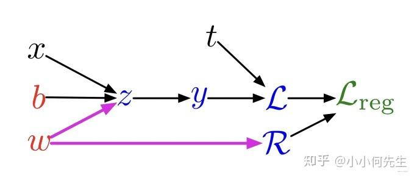

# torch如何计算梯度
## 直接计算
torch中的模型常常包含多个层，也就是多种运算，
可以直接展开。使用一个简单例子，即线性层加激活函数。样本为$(x,t)$
$$ z=wx+b$$
$$y=\sigma(z)$$
$$\mathcal{L}=\frac{1}{2}(y-t)^2$$
$$R=\frac{1}{2}w^2$$
$$\mathcal{L_reg}=\mathcal{L}+\lambda R$$
展开后为
$$\begin{aligned}\mathcal{L_reg}&=\frac{1}{2}(y-t)^2+\lambda \frac{1}{2}w^2\\
&=\frac{1}{2}(\sigma(wx+b)-t)^2+\lambda \frac{1}{2}w^2\\
\end{aligned}$$
其中$\lambda$是超参数  
为了进行梯度下降，需要对线性层的参数$w$和$b$进行梯度下降，于是有
$$
\begin{aligned}
\frac{\partial{\mathcal{L}}}{\partial{w}}&=(\sigma(wx+b)-t)\sigma^{'}(wx+b)x+\lambda w\\
\frac{\partial{\mathcal{L}}}{\partial{b}}&=(\sigma (wx+b)-t)\sigma^{'}(wx+b)\\
\end{aligned}
$$
计算过程非常繁琐，另外有些步骤被重复计算，如$wx+b$

# 计算图模式

 
根据计算图可以知道

$$\frac{\partial{\mathcal{L_reg}}}{\partial{w}}=\bar z\frac{\partial{\mathcal{z}}}{\partial{w}}+\bar R\frac{\mathrm{d}R}{\mathrm{d}w}$$
再按照同样的方式就可以获得关于$w$和$b$的微分